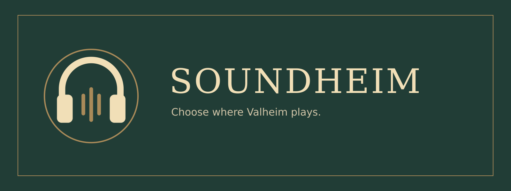

  

# Custom Audio Output Device

Choose where Valheim plays its audio, directly in **Settings → Audio**.
Only the player needs this mod. Nothing is installed on the server.

## Use

1. Open **Settings → Audio** from the main menu or while playing.
2. Choose **Output device**, below the existing audio controls. Changes preview immediately.
3. Click **OK** to remember your choice. **Back** restores the saved choice.

**System default** follows your operating system's default output. The mod routes
Valheim's audio; it does not change the system default or move other applications.
Device lists refresh automatically. If your selected device disconnects, the mod
keeps its preference and retries when it returns.

## Platforms

| Platform | Support |
| --- | --- |
| Linux with PulseAudio or PipeWire's PulseAudio service | Audio routing tested locally; requires `pactl` with JSON output support |
| Windows 10/11 | **Experimental**, with a successful user test on Windows. Uses Windows per-app audio preferences. If an existing stream does not move, save the selection and restart Valheim. |
| macOS | Not supported |

The Audio tab shows routing errors and whether a selected device is disconnected.
Detailed errors also appear in `BepInEx/LogOutput.log`.

## Installation

Install **Custom Audio Output Device** through r2modman or Thunderstore Mod Manager.
Requires BepInExPack Valheim. For manual installation, copy `Soundheim.dll` into
`BepInEx/plugins/Soundheim` in your profile, then restart Valheim.

Configuration is stored in `BepInEx/config/augusdogus.mods.Soundheim.cfg`.
Windows also persists the per-app output preference in the operating system.
Choose **System default** and save before removing the mod if you want to clear it.

## Development

See [development and testing](docs/DEVELOPMENT.md) and [repository layout](docs/REPOSITORY.md).
Release tooling comes from [ValheimModTemplate](https://github.com/AugusDogus/ValheimModTemplate).
